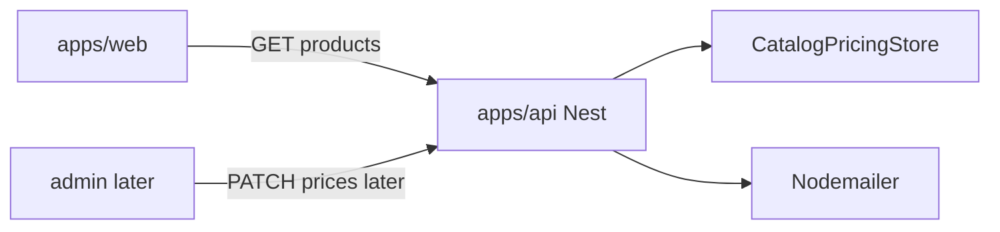
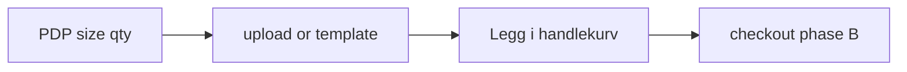
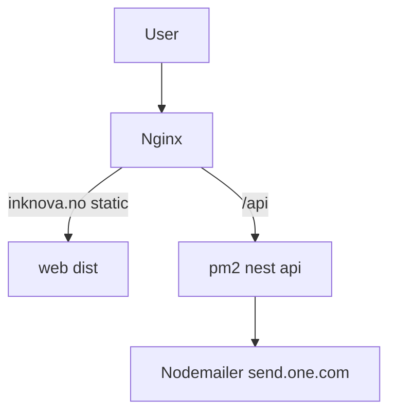

# InkNova — план монорепо (A → C → B)

## Решения (зафиксировано)

- **Стек:** pnpm workspaces — `apps/web` (Vite + React + TS + Tailwind + shadcn/ui), `apps/api` (NestJS + TS), `packages/shared` (типы продуктов, DTO, i18n-ключи).
- **UI:** shadcn/ui (MIT, бесплатно). Анимации позже вручную.
- **Фазы:** **A** (витрина + письма) → **C** (дизайн/upload) → **B** (Vipps/checkout), когда будут данные по оплате.
- **Язык:** `nb-NO` основной UI; i18n-слой сразу (ключи + файлы `nb`/`en`), EN можно заполнять постепенно.
- **Цены/доставка:** **сразу только через API** — во фронте нет захардкоженных NOK/сроков/доставки (только отображение ответа API + i18n-лейблы). Фаза A: JSON seed + `CatalogService`. Позже админка/БД без переписки витрины и PDP.
- **Почта:** **Nodemailer** + SMTP one.com (`send.one.com`).
- **Деплой:** **Nginx + pm2** на своём VPS. Docker не используем. БД в фазе A не поднимаем; появится вместе с админкой.
- **VPS не входит в план** — сервер берёте сами; в репо — `ecosystem.config` + инструкция Nginx/DNS.

## Почта (Nodemailer + one.com)

Домен `inknova.no` на one.com (Aida Portfolio → 1 inbox 3 GB).

- Ящик: `Kontakt@inknova.no` в панели one.com.
- Nest `MailService` через **Nodemailer**, SMTP с VPS:
  - `SMTP_HOST=send.one.com`
  - `SMTP_PORT=587` (STARTTLS)
  - `SMTP_USER` / `SMTP_PASS` = email + пароль ящика
  - `CONTACT_TO=Kontakt@inknova.no`
- `mailout.one.com` не используем (он для сайтов, хостящихся у one.com).
- Фаза A: `POST /api/contact` → письмо на Kontakt. Вложения Copycat — фазы C/B.
- DNS при деплое: **A** → IP VPS; **MX** one.com не трогать.

## Архитектура

- **Путь покупателя:** товар → размер/кол-во → **дизайн/upload** → корзина → оплата → почта. (В исходном ТЗ было «корзина → дизайн»; берём ваш порядок: дизайн до add to cart.)
- Витрина/PDP: `price`, `delivery`, `leadTime` только из `GET /api/products` / `:slug`.
- **Корзина:** **localStorage** (нет ЛК покупателя). Line item: `productId`, `sizeId`, `qty`, снапшот `unitPrice`; с фазы C обязательны `designFileId` и/или `templateId`.
- **Фаза A:** `CatalogService` + JSON-seed (заглушки). Цены не живут в React-компонентах.
- **Будущая админка:** тот же JSON-контракт продуктов; стор → БД. Витрина/PDP/корзина не переписываются.
- API сейчас: `contact`, `catalog`. Позже: `orders`, `payments`, `uploads`, `admin`.
- Shared: типы `Product`, `SizeOption`, `CartItem`, схемы валидации.

## Фаза A — витрина и контент (сейчас)

**Монорепо-скелет**

- Root: `pnpm-workspace.yaml`, `turbo` опционально (можно без turbo на старте), ESLint/Prettier общие.
- `apps/web`: Vite, React Router, Tailwind v4/v3 + shadcn, `react-i18next` (или `i18next`).
- `apps/api`: NestJS, CORS на web, `ConfigModule`, validation pipe (`class-validator` / zod).
- `packages/shared`: типы продуктов и размеры из [requirements and assets/text](requirements%20and%20assets/text).

**Дизайн/страницы (ориентир trykk24 + IKEA PDP)**

- Shell: announcement bar, header (лого, корзина, meny), footer (ссылки, org nr `832028452`, email, соцсети).
- **Hjem:** лаконичная главная в духе trykk24 (герой + сетка категорий/товаров).
- **Alle produkter:** поиск + фильтр категорий + grid карточек («Sjekk pris»).
- **Produkt:** 2 колонки — галерея | название, цена, **карточки размеров как IKEA**, кол-во, срок доставки (placeholder), CTA. В фазе A CTA сразу «Legg i handlekurv» (без дизайна). В фазе C перед add — шаг дизайна/upload.
- **Handlekurv:** список позиций (без оплаты); CTA checkout disabled / «Kommer snart».
- **Om oss, FAQ, Kontakt, Artikler** (1–2 SEO-статьи-заглушки), **Angrerett/reklamasjon** (текст из ТЗ).
- Соцсети: FB, IG, TikTok, LinkedIn, Pinterest (URL из env/конфига).

**Данные продуктов (10 SKU)**

Flyers, visittkort, plakater, klistremerker, arbeidstegninger, rollup, magasin, folie (custom max 120×100), alu skilt, forex — размеры как в ТЗ. Цены/lead time/доставка — seed в сторе API; фронт только `GET /api/products` и `GET /api/products/:slug`.

**Почта (фаза A)**

- `POST /api/contact` → Nodemailer → `Kontakt@inknova.no` через `send.one.com`.
- Rate limit + валидация; SMTP-секреты только в `.env`.

**i18n**

- Все строки UI через ключи; контент статей/FAQ сначала на `nb`, для `en` — те же ключи (можно копией nb, пока нет перевода).

## Фаза C — дизайн (после A)

Поток: **выбрал товар и размер → персонализация → только потом в корзину**.

- После выбора размера/кол-ва на PDP (или отдельный шаг `/products/:slug/design`): drag-and-drop **PDF/PNG** и/или выбор шаблона. Без готового файла/шаблона в корзину нельзя.
- Upload на API → временное хранение на диске VPS (позже S3 при необходимости); валидация MIME/размера.
- В line item корзины: `designFileId` / `templateId` уже заполнены в момент add.
- Позже отдельной подзадачей: редактор поверх шаблонов + export print-ready PDF (3 mm bleed, crop marks). В A UI редактора нет; в типах корзины сразу поля под `designFileId` / `templateId` (optional до фазы C).

## Фаза B — оплата и checkout (когда будут данные)

- Checkout: адрес, контакты, выбор Vipps/kort.
- Vipps ePayment API (Vipps + card в одном API).
- После оплаты: письмо в Copycat Lillestrøm (тема: продукт + имя; тело: имя, продукт, antall, adresse; вложение файла).
- Цены доставки/товаров по-прежнему из `CatalogService` — к моменту B желательно уже БД+админка, иначе правки через JSON/restart.

## Фаза позже — админка заказчика

Не входит в текущий MVP, но архитектура A под это:

- UI: правка цен по размерам, правил доставки, lead time.
- Auth: один админ-аккаунт (env или таблица users).
- Persist: SQLite на том же VPS достаточно на старте; при росте — Postgres.
- Витрина без изменений контракта `GET /api/products`.

## Деплой на VPS (Nginx + pm2)

VPS покупаете сами; в репо — конфиги и краткая инструкция.

- Сборка: `pnpm --filter web build`, `pnpm --filter api build`.
- **pm2:** `ecosystem.config.cjs` → процесс `inknova-api`.
- **Nginx:** TLS (Let's Encrypt), `/api` → `localhost:3000`, остальное → SPA `try_files` из `apps/web/dist`.
- **Env:** `SMTP_HOST=send.one.com`, `SMTP_PORT=587`, `SMTP_USER` / `SMTP_PASS`, `CONTACT_TO`, `CORS_ORIGIN`.
- **DNS one.com:** A → IP VPS; MX не менять.

## Порядок реализации (фаза A)

1. Скелет монорепо + shared типы продуктов/размеров.
2. Nest: products config endpoint + contact + MailService (Nodemailer).
3. Web: layout, i18n nb(+en stub), главная + каталог + PDP (IKEA sizes) + корзина.
4. FAQ / Om oss / Kontakt / juridisk / статьи-заглушки + соцссылки.
5. README: локальный запуск, env example, набросок pm2/Nginx.
